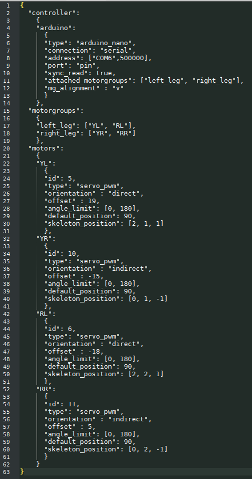
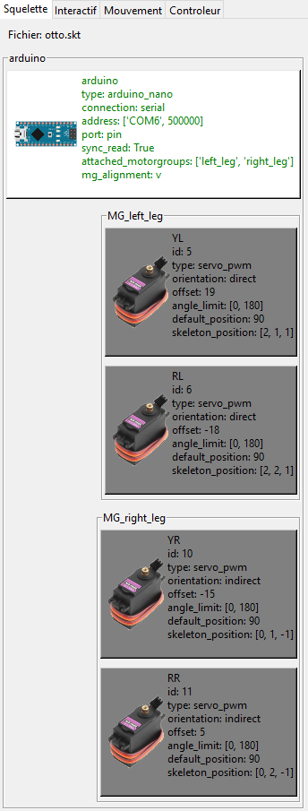
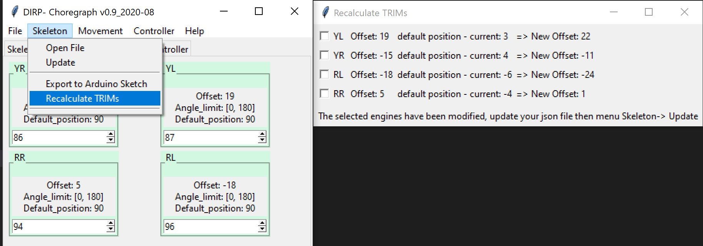

# Choreogrpah (beta) v0.9

Environement logiciel permettant le paramétrage de robots à base de servo-moteur.  
[English Version](https://github.com/Nao974/M-BOXE_MANAGER_TK/blob/master/README.md)  

## Choreograph vous permet

- Une **Description structurée** de vos robots  
Sur la base d'un fichier JSON, vous allez pouvoir décrire chaque controleur, chaque servo moteur et les regrouper pour former chaque membre de votre robot.

&nbsp;
 

[Détail sur le format du fichier](docs/skeleton/file_format_skeleton_fr.md)  

---

- Déterminer la **position neutre (trim)** de chaque servo.  
Une fois le fichier de squelette chargé, vous pourrez rechercher la position initiale de chaque servo-moteur de manière interactive et mettre à jour votre fichier JSON.  

  

[Recalcule Trim](https://github.com/Nao974/choreograph-git/blob/master/docs/skeleton/file_format_skeleton_fr.md)  

---

- Pilotage en **temps réel** et création de **SnapShoot** de position  
blabalald  

  

[Recalcule Trim](https://github.com/Nao974/choreograph-git/blob/Update-Docs/docs/trim/trim_fr.md)  

- **création de mouvement** par enchainement de positions préalablement enregistrées  
blablabal  

  

[Recalcule Trim](https://github.com/Nao974/choreograph-git/blob/Update-Docs/docs/trim/trim_fr.md)  

- **Génération automatique** de scripts pour Arduino  
blablabal  

  

[Recalcule Trim](https://github.com/Nao974/choreograph-git/blob/Update-Docs/docs/trim/trim_fr.md)  

- **Pilotage du robot** par le clavier ou manette Bluetooth  
blablabal  

  

[Recalcule Trim](https://github.com/Nao974/choreograph-git/blob/Update-Docs/docs/trim/trim_fr.md)  

- Prise en charge de **plusieurs types** de servo-moteurs (pwm, serie, autres)  
blabal  

  

[Recalcule Trim](https://github.com/Nao974/choreograph-git/blob/Update-Docs/docs/trim/trim_fr.md)  

- **Multi langues**  
blablabal  

  

[Recalcule Trim](https://github.com/Nao974/choreograph-git/blob/Update-Docs/docs/trim/trim_fr.md)  
