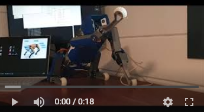
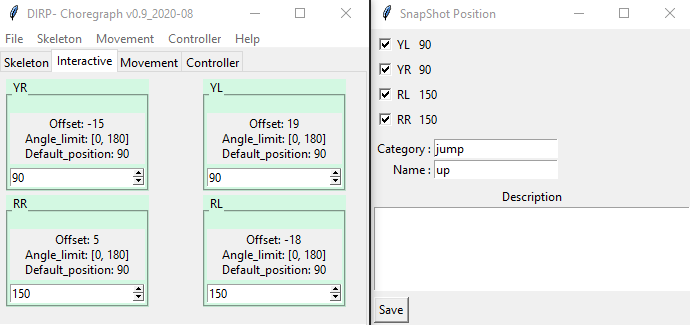
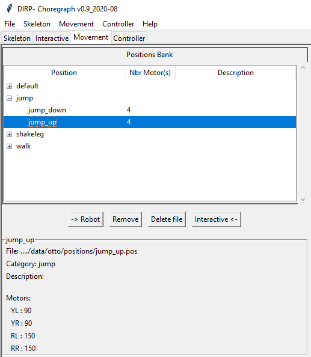
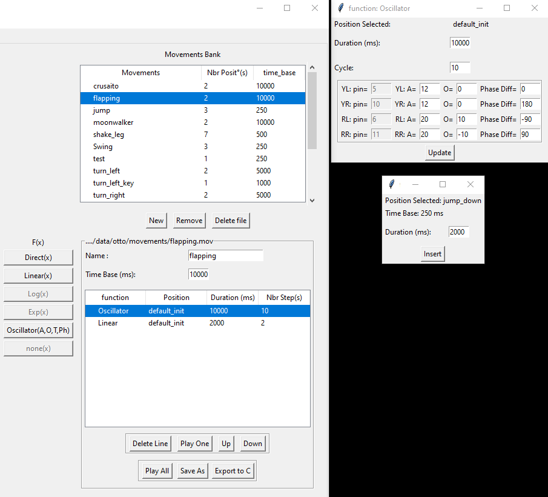
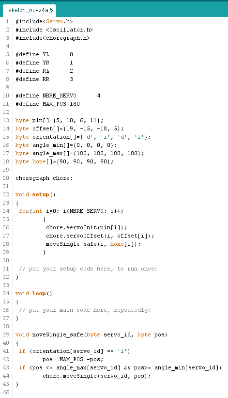
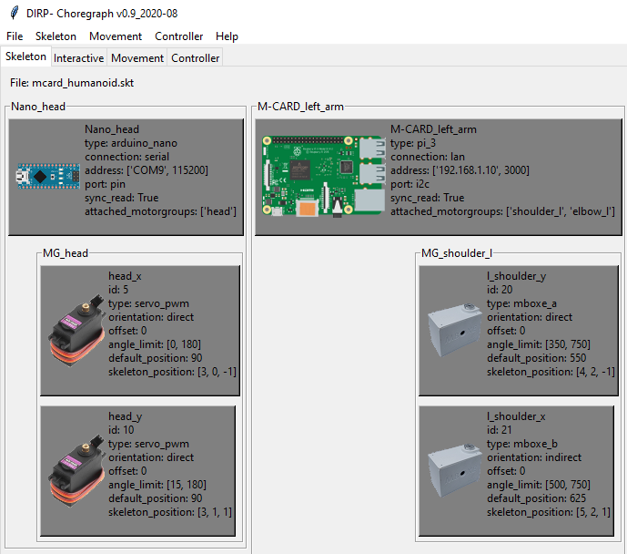
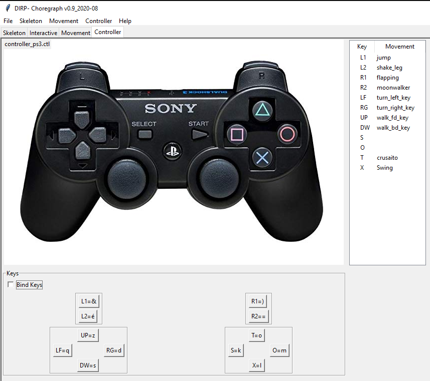
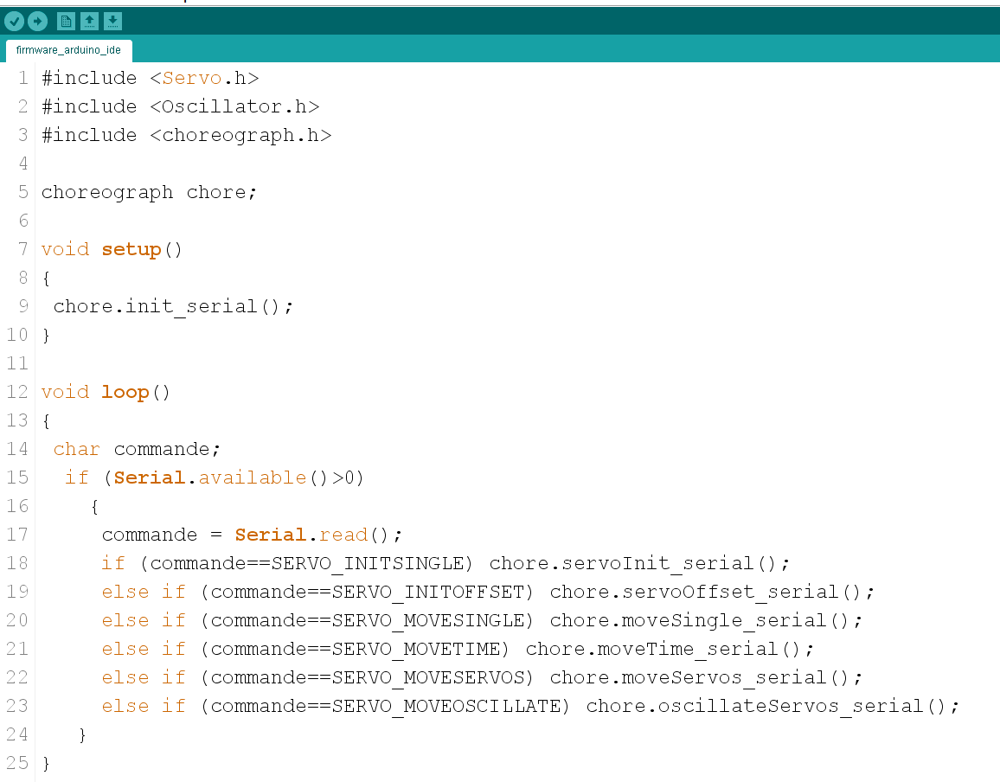
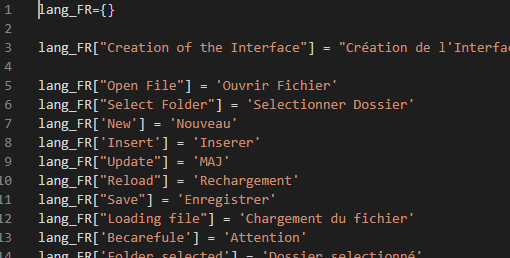

# Choreograph (beta) v0.9

[Version française](./README_fr.md)

[Quickstart](#quickstart)

---

Software environment allowing the parameterization of servo-motor-based robots.

## Choreograph allows you

- A **Structured Description** of your robots  
On the basis of a JSON file, you will be able to describe each controller, each servo motor and group them to form the members of your robot.

&nbsp;
  

[=> learn more](docs/skeleton/file_format_skeleton.md)

---

- Determine the **neutral position (trim)** of each servo.  
Once the skeleton file has been loaded, you will be able to find the initial position of each servo motor and recalculate their offset.

  

[=> learn more](docs/trim/desc_trim.md)

---

- Control in **real time** each servo motor independently and record **SnapShot** positions.

&nbsp;
  

[=> learn more](docs/position/desc_position.md)

---

- **Create movements** by chaining previously recorded positions, thanks to configurable transitions.

  

[=> learn more](docs/movement/desc_movement.md)

---

- **Export in C language** the description of the skeleton and movements for direct integration into your source codes.

&nbsp;
  

[=> learn more](docs/export_c/desc_export_c.md)

---

- Support for **several types** of controllers (Arduino Uno, Nano, Mega, Raspberry) and servo motors (pwm, series). It suffices to declare them in the description of the skeleton.

  

[=> learn more](docs/multi_type/desc_multi_type.md)

---

- **Pilot your robot** by attaching the configured movements to the keys of the keyboard or your Bluetooth controller.

  

[=> learn more](docs/controller/desc_controller.md)

---

- The **Firmware** must be loaded into your robot.
Available for Arduino boards, it is to be loaded from the Arduino IDE.
VSCode PIO support is under development along with other Micro Controller cards.

  

[=> learn more](docs/firmware/desc_firmware.md)

---

- **Multi languages**, available in English and French, the languages ​​are stored in the form of an easily modifiable dictionary.

  

---

- All the setting formats are described in the following link.

[=> learn more](docs/file_format.md)

---

## Quick Start

OK, you have assembled your robot and carried out some good functioning tests on the various servo-motors, now it's time for Movements !!!

**Everything happens in the *. / Data folder***

- duplicate the *.data/_default_project* folder
  - rename it with the name of your project
- duplicate the file *. / data / _defaut_project.pjt
  - rename it with the name of your project
  - open it is to modify the following tags at least
    - **description**: with the previously of your robot
    - **filepath**: modify the path with the name of the previously renamed folder
    - [=> full format of the project file](docs/projet/file_format_project.md)
- in your project folder, replace the **view.jpg** file with an image of your robot, it will be displayed each time your project is loaded.

---

Now let's modify the description file of your robot by opening the *skeleton.skt* file

- At a minimum, you should modify
  - on the *controller* node
    - the type of your card
    - connection and port
  - describe each servo motor
  - you can now group the servomotors of each member in the *motorgroups* node
  - and finally attach these *motorgroups* to the right controller
- All the details can be found in the documentation [=> complete format squeleton.skt](docs/skeleton/file_format_skeleton.md)

---

Load the firmware *Choreograph* into your card [=> firmware documentation](docs/firmware/desc_firmware.md)

---

- You can now save your own positions
  - [=> documentation on positions](docs/position/desc_position.md)
- Then chain them in the form of movements
  - [=> documentation on movements](docs/movement/desc_movement.md)
- Control your robot from your keyboard or BT controller
  - [=> documentation on controllers](docs/controller/desc_controller.md)

---

[=> Top](#up)
