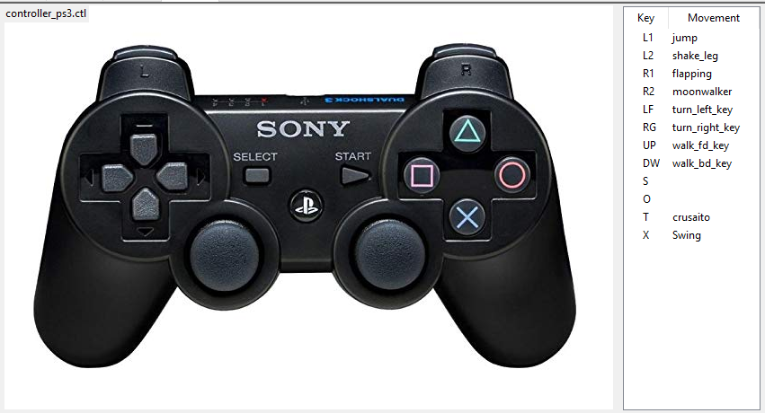
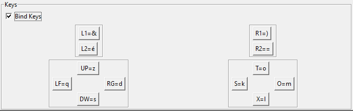

# Controller

Now that you have created your movements, rather than choosing them from the bank, click on the *Play* button, then choose another movement, click on the *Play* button, then choose another movement, click on the *Play button*, then choose another movement, click on the *Play* button ...

You can *attach* your movements to keyboard or controller keys and thus check the sequences.

## By Bluetooth controller

Editing your *controller.ctl* file is indicating the name of your movements on the buttons you want:

 
  
On Windows, you should start the **JoytoKey** program that you will find in the *\bin\win_joytokey* folder.
By running *Choreograph* through the batch, Joytokey will be launched automatically.

---

## By Keypad

Beforehand, you should attach your movements to the buttons of the controller, even if you do not intend to use it.

Then link the keyboard keys to the joystick buttons.
To start the keyboard capture, check the *Bind Keys* box

---

## Controller.json file format

[=> file_format_controller](./file_format_controller.md)

---

[<= Return](../../README.md#controller)
