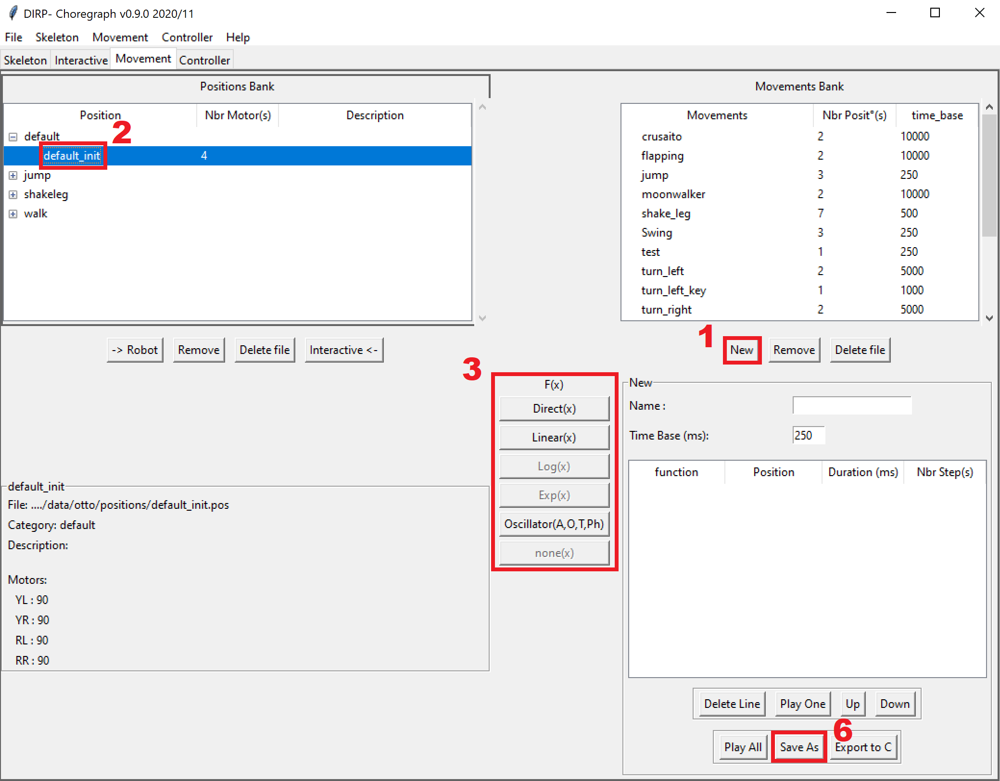
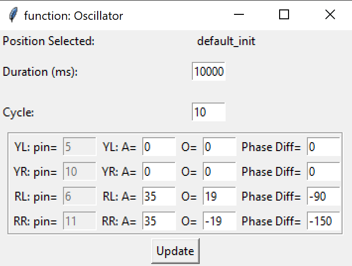
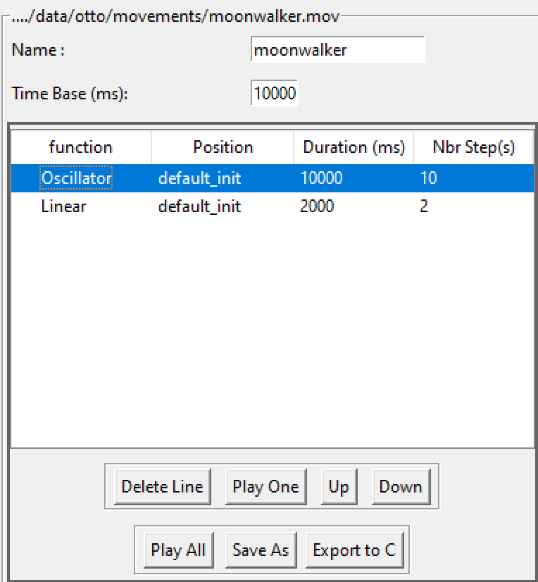
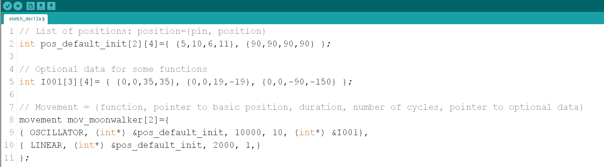
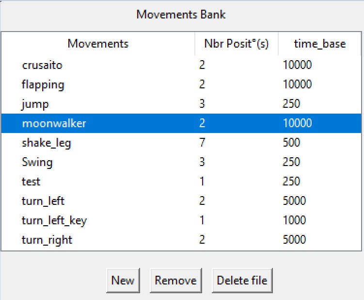

# Les Mouvements

Un mouvement est un enchainement de postion par des fonctions prédéfinies.

## Création d'un mouvement

1. Sous la banque des mouvements, cliquer sur **Nouveau**

    - Indiquer le nom de votre mouvement

    - La base de temps par défaut

2. Selectionner la position à inserer par simple clique dans la banque des postions

3. Choisir la fonction de transformation

4. paramétrer la fonction suivant votre besoin, puis cliquer sur **insérer**

5. refaire ces opérations pour inserer une nouvelle position

6. Cliquer sur **Enregister sous**  pour sauvegarder votre mouvement

    - Il faut cliquer sur **enregistrer sous** afin de l'enregistrer dans la banque de mouvement, vous pouvez annuler l'enregistrement du fichier si vous le souhaitez.

---

## Les différentes fonctions de transformation

### Direct(x)

Application directe de la position sans aucune notion de durée.

Paramètre:

- Aucun.

### Linear(x)

Déplacement vers la position en x ms. Calcule du *pas* de chaque servo-moteur afin que l'ensemble des servo-moteurs arrivent au meme moment.

Paramètre:

- La Durée en ms

### Oscillator(A, O, T, Ph)

Oscillateur sinusoidale sur la base de la librairie oscillator.h

Paramètres:

- Durée: Période en milliseconde
- Cycle: Nombre de boucle
- A: Amplitude en degré
- O: Offset en degré
- Phase Diff: Décalage de phase

---

## Actions sur les mouvements

Selectionner votre mouvement dans la banque, les détails des positions et fonction de transformation s'affiche en dessous avec les boutons suivants:

- Delete Line: supprime la ligne de position selectionnée
- Play One: Joue uniquement la position selectionée
- Up: Déplace la position une ligne au dessus
- Down: Déplace la position une ligne en bas
- Play All: Joue l'ensemble du mouvement
- Save as: Sauvegarde votre mouvement
- Export to C:  Transforme votre mouvement en code C
    

---

## Gestion des mouvements

Selectionner votre mouvement dans la banque:

- New: Création d'un nouveau mouvement
- Remove: Supprime le mouvement de la banque, mais pas le fichier
- Delete file: Supprime le fichier et le mouvement dans la banque

---

## Format du fichier movement.json

[=> file_format_movement_fr](./file_format_movement_fr.md)

---

[<= Retour](../../README_fr.md#movement)
