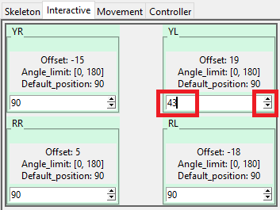
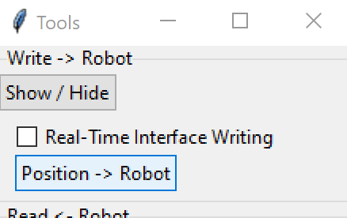
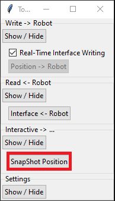
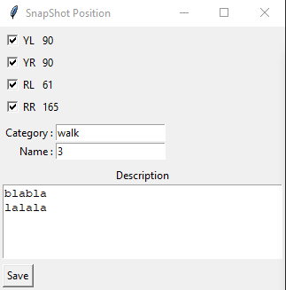
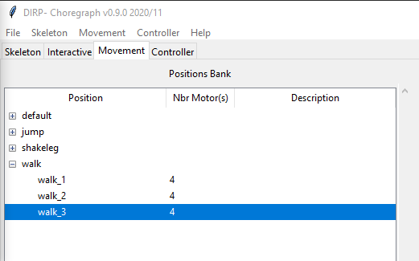
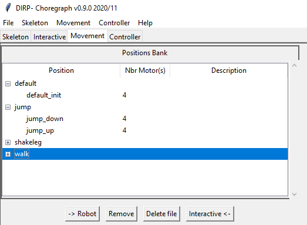

# Commande en temps Réel et enregistrement de postures

Une fois votre robot monté, votre fichier de description de squelette créé, le firmware chargé dans votre robot et les positions initiales paramétrées, on va pouvoir commencer à faire des choses interressantes :)

## Commande en temps Réel

Rien de plus simple, à partir de l'onglet **Interactif** modifier la position actuelle soit en entrant une postion manuellement, soit en utilisant les flèches haut bas ==> le servo-moteur bouge en conséquence.

Si vous ne souhaitez pas que les servo-moteurs bougent à chaque changement, vous pouvez décocher "Real-Time Inferface Writing", puis une fois l'ensemble des positions saisies, cliquer sur le bouton "Position->Robot" afin de les envoyer à votre robot en une seule fois.

---

## Enregistrement de postures

Grâce à la commande en temps réel de vos servo-moteurs, votre robot est maintenant dans la position que vous recherchez, il vous suffit de cliquer sur **"SnapShoot"** de la fenêtre *"Tools"* afin d'enregistrer cette posture.  

Par défaut, l'ensemble des servo-moteurs sont pris en compte, vous pouvez décocher ceux qui ne vous interessent pas, indiquer :  

- la catégorie qui serviera de rubrique dans la banque de postion
- le nom de la posture
- une description de celle ci

En cliquant sur enregistrer, cela placera votre nouvelle posture dans la banque et vous proposera de l'enregistrer sur votre disque.

&nbsp;
 

---

## La Banque de Positions

Elle est chargée à partir du dossier contenant les fichiers **.pos**, soit lors de l'ouverture du projet, soit aprés avoir ouvert séparement le fichier squelette puis par le menu *Mouvement-> Charger Position(s)*.  
*La création d'un fichier de description de votre projet est fortement recommandé ([format .pjt](../projet/file_format_project_fr.md) )*.  

Elle permet de lister et catégoriser les postures enregistrées.

- **->Robot** vous permet d'envoyer directement la position selectionnée à votre robot, et met à jour l'onglet interactif

- **Remove** supprime la position selectionnée de la liste mais ne supprime pas le fichier  

- **Delete file** supprime la position selectionnée de la liste ainsi que le fichier

- **Interactive<-** envoie la position à l'onglet *Interactive* mais pas au robot

---

## Format du fichier position.json
[=> file_format_position_fr](./file_format_position_fr.md)

---

[<= Retour](../../README_fr.md)
