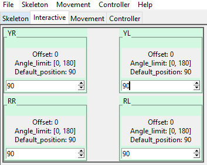
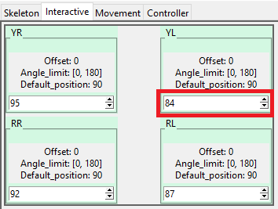
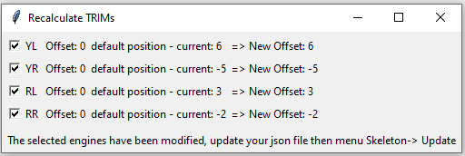
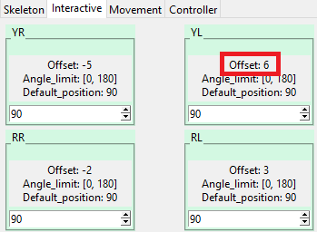

# Determine the neutral position (trim)

When you assemble your robot, you will certainly position your servomotors on their median value and then mount the lifter. But it may not be oriented exactly the way you want it to.
You will therefore be able to increment or decrement the neutral position of your servomotors in order to place it in the desired position.

1. Before assembly, position your servo motors **on the neutral position** (90 ° between [0; 180]) from a small Arduino script (available on the internet)

2. Assemble your robot by placing each lifter in the middle position

3. Configure your JSON skeleton file as below for each servo motor then launch ***Choreograph***:

    - "offset": 0
    - "default_position": 90

      

4. Load the firmware into your controller card [=> firmware](../firmware/desc_firmware.md)

5. For each servo motor, refine the position with the up / down arrows of each servo motor.
    

6. Start the offset recalculation

    <div align="center">&nbsp;</div>  

7. Update your JSON file by modifying the "offset" parameter of your servo motors with the value indicated in the recalculation

    ```json
    "YL":
        {
         ...
         "offset" : 6,
         "angle_limit": [0, 180],
         "default_position": 90,
         ...
        }
    ```

8. Reload your skeleton file using the Squelette-> Update menu

    

---
[<= Return](../../README.md#desc-trim)
